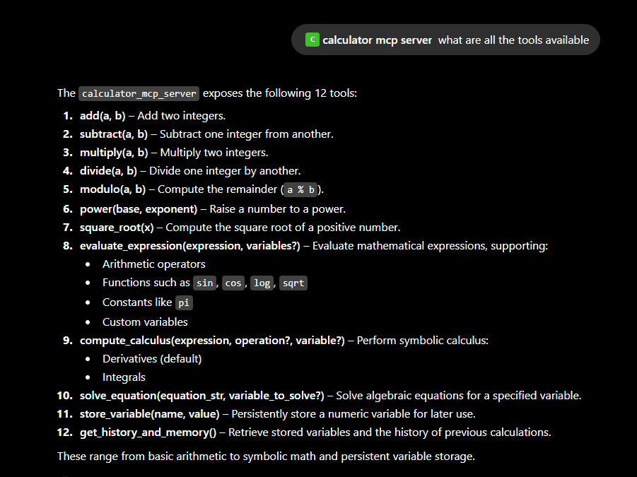
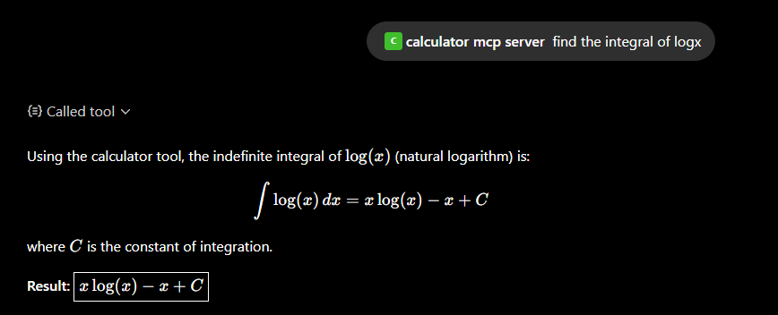
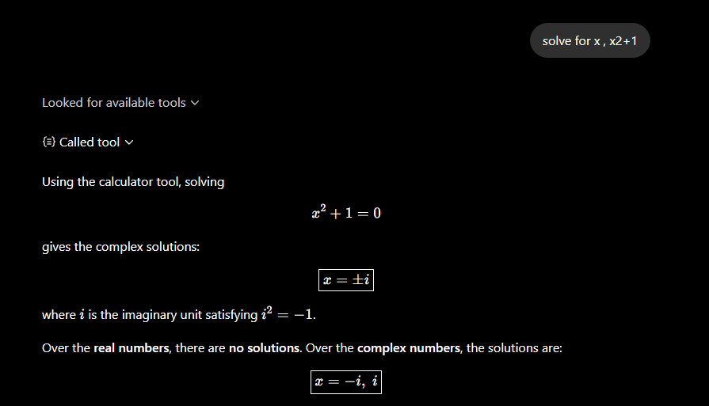
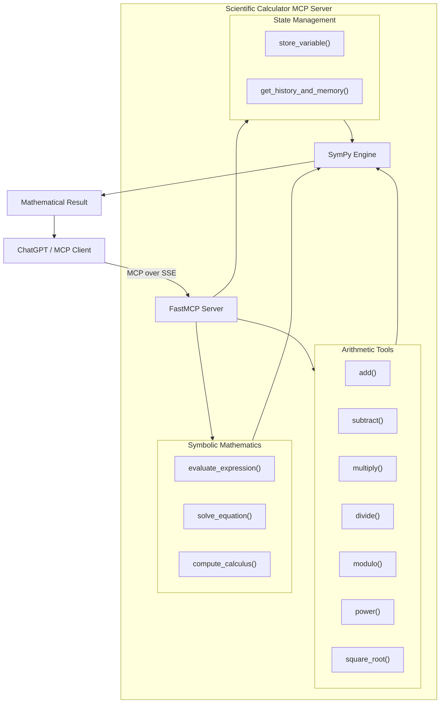
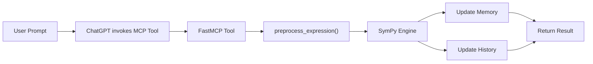
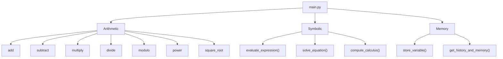
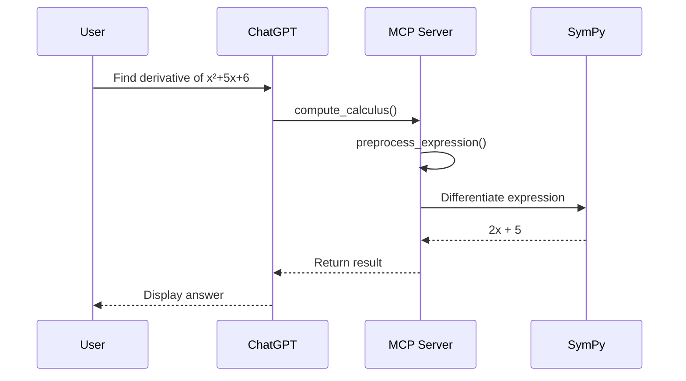

# Scientific Calculator MCP Server

A Model Context Protocol (MCP) server built using **FastMCP** and **SymPy** that provides both numerical and symbolic mathematical operations to any MCP-compatible client such as ChatGPT.

The server exposes a collection of mathematical tools through the MCP protocol, allowing AI assistants to perform calculations, solve equations, evaluate expressions, compute derivatives and integrals, store variables, and maintain calculation history.

---

# Features

- Basic arithmetic operations
- Power and square root calculations
- Modulo operation
- Symbolic expression evaluation using SymPy
- Symbolic equation solving
- Symbolic differentiation
- Symbolic integration
- Persistent server-side variable storage
- Calculation history
- Automatic preprocessing of shorthand mathematical notation
- Server Sent Events (SSE) transport
- Deployable on Render

<p align="center">
  
</p>


---

# Live Endpoint

SSE Endpoint

```
https://scientific-calculator-mcp-server.onrender.com/sse
```

---

# Technology Stack

- Python
- FastMCP
- SymPy
- Render
- Server Sent Events (SSE)

---

# Architecture

The server is implemented as a FastMCP application.

```
Client (ChatGPT / Claude Desktop / MCP Client)
                │
                │
                ▼
       FastMCP Server (SSE)
                │
                │
        Registered MCP Tools
                │
                ▼
             SymPy Engine
                │
                ▼
      Symbolic/Numeric Computation
```

The server maintains two global in-memory objects.

```
MEMORY
```

Stores user-defined variables along with the special variable `ans`.

Example

```python
{
    "ans": 15,
    "radius": 10
}
```

```
HISTORY
```

Stores the most recent calculations performed by the server.

---

# Available Tools

The server currently exposes **12 MCP tools**.

---

## 1. add

Adds two integers.

### Parameters

| Name | Type |
|------|------|
| a | int |
| b | int |

### Example

Input

```
add(10, 15)
```

Output

```
25
```

---

## 2. subtract

Subtracts one integer from another.

### Parameters

| Name | Type |
|------|------|
| a | int |
| b | int |

Example

```
subtract(20, 5)
```

Output

```
15
```

---

## 3. multiply

Multiplies two integers.

### Parameters

| Name | Type |
|------|------|
| a | int |
| b | int |

Example

```
multiply(8, 12)
```

Output

```
96
```

---

## 4. divide

Performs integer division.

### Parameters

| Name | Type |
|------|------|
| a | int |
| b | int |

Example

```
divide(25, 5)
```

Output

```
5
```

### Notes

- Uses Python integer division (`//`)
- Division by zero raises an exception

---

## 5. power

Raises a base to a specified exponent.

### Parameters

| Name | Type |
|------|------|
| base | float |
| exponent | float |

Example

```
power(2, 10)
```

Output

```
1024
```

---

## 6. square_root

Computes the square root of a positive number.

### Parameters

| Name | Type |
|------|------|
| x | float |

Example

```
square_root(81)
```

Output

```
9
```

Negative values produce an error.

---

## 7. modulo

Returns the mathematical remainder.

### Parameters

| Name | Type |
|------|------|
| a | float |
| b | float |

Example

```
modulo(17, 5)
```

Output

```
2
```

---

## 8. evaluate_expression

Evaluates mathematical expressions using SymPy.

This tool supports

- Arithmetic operators
- Parentheses
- Exponents
- Trigonometric functions
- Logarithms
- Square roots
- Constants
- Variables
- Previously stored variables

### Parameters

| Name | Type |
|------|------|
| expression | string |
| variables | dictionary (optional) |

### Supported Functions

```
sin()
cos()
tan()
asin()
acos()
atan()
log()
sqrt()
exp()
factorial()
```

### Supported Constants

```
pi
E
I
```

### Examples

```
2+5*8
```

```
sqrt(144)
```

```
sin(pi/2)
```

```
log(10)
```

```
3*x+4
```

with

```python
{
    "x": 5
}
```

Result

```
19
```

The result is automatically stored in

```
ans
```

and appended to the calculation history.

---

## 9. solve_equation

Solves symbolic algebraic equations.

The provided expression is assumed to be equal to zero.

### Parameters

| Name | Type |
|------|------|
| equation_str | string |
| variable_to_solve | string |

### Examples

Input

```
x2-4
```

Output

```
[-2, 2]
```

Input

```
x2+1
```

Output

```
[-I, I]
```

Input

```
x3-8
```

Output

```
[2, -1 - sqrt(3)I, -1 + sqrt(3)I]
```

---

## 10. compute_calculus

Performs symbolic differentiation and integration.

### Parameters

| Name | Type |
|------|------|
| expression | string |
| operation | derivative / integral |
| variable | string |

### Derivative

Input

```
x3+2*x
```

Output

```
3*x2+2
```

### Integral

Input

```
log(x)
```

Output

```
x*log(x)-x+C
```

### Additional Examples

Derivative

```
sin(x)
```

Result

```
cos(x)
```

Integral

```
cos(x)
```

Result

```
sin(x)+C
```

---

## 11. store_variable

Stores a numeric variable in server memory.

### Parameters

| Name | Type |
|------|------|
| name | string |
| value | float |

Example

```
store_variable("radius",20)
```

Later

```
evaluate_expression("pi*radius2")
```

works without redefining the variable.

Reserved variable names cannot be used.

```
pi
e
i
```

---

## 12. get_history_and_memory

Returns

- Stored variables
- Recent calculation history

Example

```json
{
    "stored_variables": {
        "ans": "12",
        "radius": "20"
    },
    "recent_history": [
        "2+3=5",
        "radius2*pi=1256.63"
    ]
}
```

---

# Expression Preprocessing

The server preprocesses shorthand mathematical notation before passing expressions to SymPy.

Examples

| User Input | Converted Expression |
|------------|---------------------|
| x2 | x**2 |
| y3 | y**3 |
| radius2 | radius**2 |

This allows natural mathematical notation without explicitly typing Python exponent syntax.

For example

Input

```
x2+5*x+6
```

Internally becomes

```
x**2+5*x+6
```

---

# Memory

The server maintains an in-memory dictionary of variables.

Initially

```python
{
    "ans": 0.0
}
```

Users can store values

```
store_variable("a",10)
```

Later

```
evaluate_expression("a2+5")
```

returns

```
105
```

The value of `ans` is updated after every successful expression evaluation.

---

# History

Every evaluated expression is appended to the history list.

The most recent calculations can be retrieved using

```
get_history_and_memory()
```

---

# Connecting the Server to ChatGPT

The server uses the **Server-Sent Events (SSE)** transport and does **not require OAuth authentication**.

## Step 1

Open ChatGPT.

Navigate to

```
Settings
```

Enable

```
Developer Mode
```

if it is not already enabled.

---

## Step 2

Navigate to the MCP Apps section and choose

```
Create App
```

---

## Step 3

Enter the application details.

Application Name

```
Scientific Calculator MCP Server
```

Authentication

```
None
```

or

```
No Authentication
```

depending on the ChatGPT interface.

MCP Server URL

```
https://scientific-calculator-mcp-server.onrender.com/sse
```

---

## Step 4

Review the warning regarding connecting to a custom MCP server.

Accept the warning and continue.

---

## Step 5

Click

```
Create
```

or

```
Connect
```

Since this server does not implement OAuth, no authorization flow is required.

---

## Step 6

After the connection is established, ChatGPT automatically discovers all available MCP tools.

The server is now ready to use.

---

# Example Prompts

Basic arithmetic

```
Add 256 and 128
```

Expression evaluation

```
Evaluate

sqrt(625)+sin(pi/2)
```

Equation solving

```
Solve x²−9
```

Derivative

```
Find the derivative of x³+4x²+7
```

Integral

```
Integrate sin(x)
```

Variable storage

```
Store radius = 25
```

Reuse variable

```
Evaluate pi*radius²
```

History

```
Show my stored variables and recent calculations
```

---

# Limitations

- Division performs integer division (`//`) rather than floating-point division.
- Variables are stored only in server memory and are lost when the server restarts.
- Equation solving assumes the supplied expression is equal to zero.
- The preprocessing function currently supports shorthand exponent notation such as `x2 → x**2`.
- Graph plotting is not currently supported.

---

# Future Enhancements

Possible future additions include

- Matrix algebra
- Linear algebra operations
- Polynomial factorization
- Partial derivatives
- Multiple integrals
- Numerical methods
- Unit conversions
- Statistical functions
- Probability distributions
- Vector calculus
- Differential equation solving
- Matrix decompositions
- Graph plotting
- Complex analysis utilities
- Scientific constants library

---

# Screenshots

### Tool Discovery

<p align="center">
  
</p>

### Symbolic Differentiation

<p align="center">
  
</p>

### Equation Solving

<p align="center">
  
</p>


## System Architecture



## Request Processing Flow



## Internal Components



## Deployment Architecture


## Request Sequence



